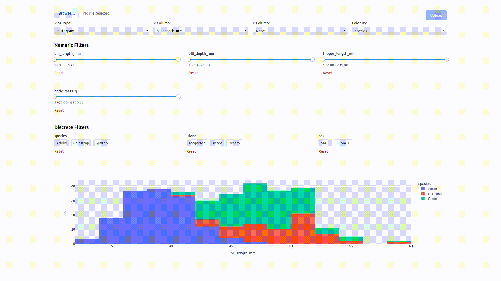

# Web Dashboard Application

This web dashboard application provides an interactive platform for data visualization and analysis. It allows users to upload custom datasets, create various types of plots, and apply dynamic filters to explore their data.



## Features

-   Interactive data visualization using Plotly
-   Dynamic chart configuration:
    -   Choose plot type (e.g., scatter, histogram, bar)
    -   Select X and Y columns for plotting
    -   Color-code data points based on a selected column
-   Flexible data filtering:
    -   Numeric filters with adjustable ranges
    -   Discrete filters for categorical data
-   Dataset import functionality:
    -   Upload custom CSV files for analysis
-   Responsive design for desktop and mobile use

## Technologies

-   Frontend: Vue 3, Plotly.js
-   Backend: FastAPI, Pandas, Plotly
-   Containerization: Docker, Docker Compose

## Project Structure

-   `backend/`: FastAPI backend code
-   `frontend/`: Vue 3 frontend code
-   `docker-compose-dev.yml`: Docker Compose file for development setup

## Getting Started

### Prerequisites

-   Docker
-   Docker Compose

### Development Setup

1. Clone the repository

2. Create a `.env` file in frontend and backend directories

3. Start the application using Docker Compose:

    ```
    docker compose -f docker-compose-dev.yml up --build
    ```

4. Access the application:
    - Frontend: http://localhost:5173
    - Backend API: http://localhost:8000
    - API Documentation: http://localhost:8000/docs

## API Documentation

The backend provides the following main endpoints:

-   `GET /api/v1/available-plots`: Returns a list of available plot types
-   `GET /api/v1/discrete-variables`: Returns a list of categorical variables in the dataset
-   `GET /api/v1/numeric-variables`: Returns a list of numerical variables in the dataset
-   `GET /api/v1/column-ranges`: Returns the min and max values for each numerical column
-   `GET /api/v1/plot-variables/{plot_type}`: Returns the available variables for a specific plot type
-   `GET /api/v1/generate-plot/{plot_type}`: Generates a plot based on the specified parameters
-   `POST /api/v1/load-dataframe`: Uploads a new dataset (CSV file)

For full API documentation, visit http://localhost:8000/docs when the application is running.

## Approach

This dashboard application was developed with a focus on:

1. Unified Plotly Integration: Utilizing Plotly for both frontend and backend to ensure consistent data visualization.
2. Dynamic User Interaction: Allowing users to customize their data view through frontend controls that interact with the backend.
3. Flexible Data Handling: Designing the system to accommodate various datasets through file uploads.
4. Modular Architecture: Separating frontend and backend for easier maintenance and scalability.
5. RESTful API Design: Clear endpoints for data retrieval, filtering, and visualization settings.

## Future Improvements

-   Implement more robust dataset import functionality, including support for various file formats and data validation
-   Add user authentication and data persistence for saving custom views and datasets
-   Incorporate statistical analysis features
-   Implement test for frontend and backend
-   Enhance data validation and error handling for more reliable performance
-   Expand visualization options with more graph types and multi-plot layouts
-   Implement data preprocessing capabilities for handling complex or unclean datasets
